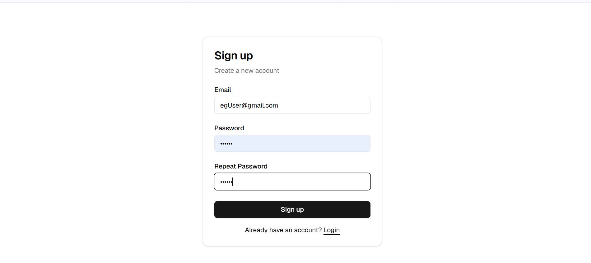
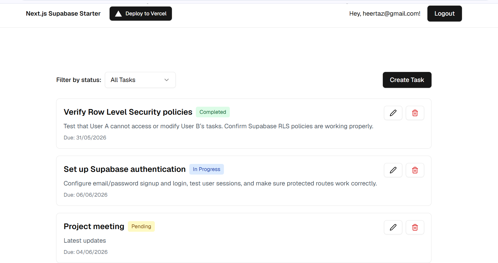
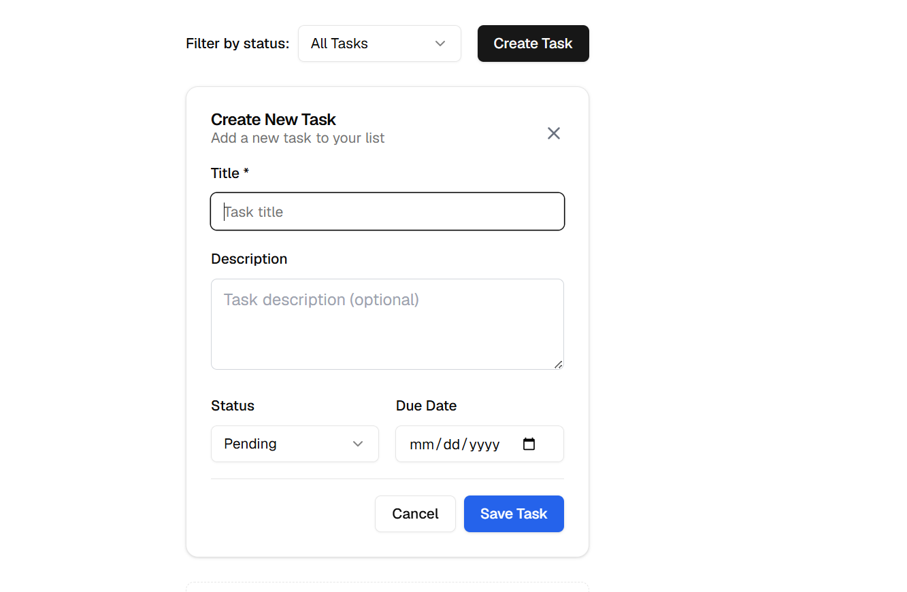

# Client Task Manager

Client Task Manager is a simple full-stack task management app built mainly to practice a realistic deployment and client handover workflow. The app includes signup, login, a protected dashboard, task CRUD, task filtering, Supabase database storage, and Supabase Row Level Security.

## Live Demo

Live Demo: https://client-task-manager-omega.vercel.app/

Current Release: v1.0.0

GitHub Repo: [Tatheer-Za-ra/client-task-manager](https://github.com/Tatheer-Za-ra/client-task-manager)

## Project Focus

This project is intentionally simple at the feature level. The goal was not to build a complex productivity product, but to practice taking a small app from local development to production deployment using real-world workflow practices.

The main focus was:

- Supabase setup
- Auth and protected routes
- Database-backed CRUD
- RLS security
- Environment variables
- Lint/build checks
- GitHub Actions CI
- Vercel deployment
- Documentation
- Client handover
- Release versioning

## What The App Does

- User can sign up and log in.
- User can access a protected dashboard.
- User can create, edit, delete, and filter tasks.
- Each user only sees their own tasks.

## What This Project Demonstrates

- Full-stack app structure with Next.js App Router
- Managed backend setup with Supabase
- Authenticated user flow
- Protected route handling
- Row Level Security for user-owned data
- Production build workflow
- GitHub Actions CI
- Vercel deployment
- Environment variable safety
- Deployment and handover documentation

## Tech Stack

| Area | Technology |
| --- | --- |
| Frontend | Next.js 16.2.6, TypeScript |
| Backend Platform | Supabase |
| Database | Supabase managed PostgreSQL |
| Auth | Supabase Auth |
| Security | Supabase Row Level Security |
| Deployment | Vercel |
| CI/CD | GitHub Actions |
| Styling | Tailwind CSS |

## Screenshots

Screenshots should be added manually after capturing the deployed app. Do not use fake screenshots.






Suggested screenshot files:

- `screenshots/home-page.png`
- `screenshots/login-page.png`
- `screenshots/dashboard.png`
- `screenshots/task-form.png`

## Supabase Database And RLS

The app uses a `tasks` table in Supabase managed PostgreSQL. Each task row belongs to a user through the `user_id` column.

Row Level Security is enabled on `public.tasks`. The policies allow authenticated users to select, insert, update, and delete only rows where `auth.uid() = user_id`.

The full SQL setup is available in [database/schema.sql](database/schema.sql).

## Documentation

- [Deployment Guide](DEPLOYMENT.md)
- [Client Handover Guide](HANDOVER.md)
- [Maintenance Guide](MAINTENANCE.md)
- [Database Schema](database/schema.sql)

## Local Setup

Install dependencies:

```bash
npm install
```

Create a local environment file:

```bash
copy .env.example .env.local
```

Add your Supabase project values to `.env.local`.

Run the development server:

```bash
npm run dev
```

Run checks:

```bash
npm run lint
npm run build
```

On Windows PowerShell, use `npm.cmd` if script execution blocks `npm`:

```bash
npm.cmd run dev
npm.cmd run lint
npm.cmd run build
```

## Environment Variables

Required variable names:

```env
NEXT_PUBLIC_SUPABASE_URL=
NEXT_PUBLIC_SUPABASE_PUBLISHABLE_KEY=
```

Do not commit `.env.local`. Do not use or expose a Supabase `service_role` key in this frontend app.

## Available Npm Scripts

```bash
npm run dev
npm run lint
npm run build
npm run start
```

- `dev`: starts the local development server
- `lint`: runs ESLint
- `build`: creates a production build
- `start`: starts the production server after a build

## Deployment Summary

This project is deployed on Vercel. The deployment workflow includes GitHub version control, GitHub Actions CI, Vercel project import, Supabase environment variables, production testing, and release/versioning.

The project does not use Docker, Kubernetes, Railway, Render, VPS, or container deployment.

## Portfolio Highlight

Client Task Manager is a simple full-stack application focused on deployment readiness. It demonstrates authentication, protected routes, database-backed CRUD, Supabase RLS, CI checks, Vercel deployment, documentation, and release/versioning practices.

## Resume Bullet

- Built and deployed a simple full-stack task management app using Next.js, TypeScript, Supabase, and Vercel, focusing on authentication, protected routes, Row Level Security, CI checks, production deployment, and client handover documentation.

## Future Improvements

- Search tasks
- Due-date reminders
- Team/workspace support
- User profile page
- Admin dashboard
- Better analytics

## Common Troubleshooting

- Login redirects fail: check Supabase Auth URL Configuration.
- Build fails in Vercel: confirm Supabase env vars are set in Vercel and redeploy.
- User cannot see tasks: confirm RLS policies are active and `tasks.user_id` matches the authenticated user.
- PowerShell blocks `npm`: use `npm.cmd run dev`, `npm.cmd run lint`, or `npm.cmd run build`.
